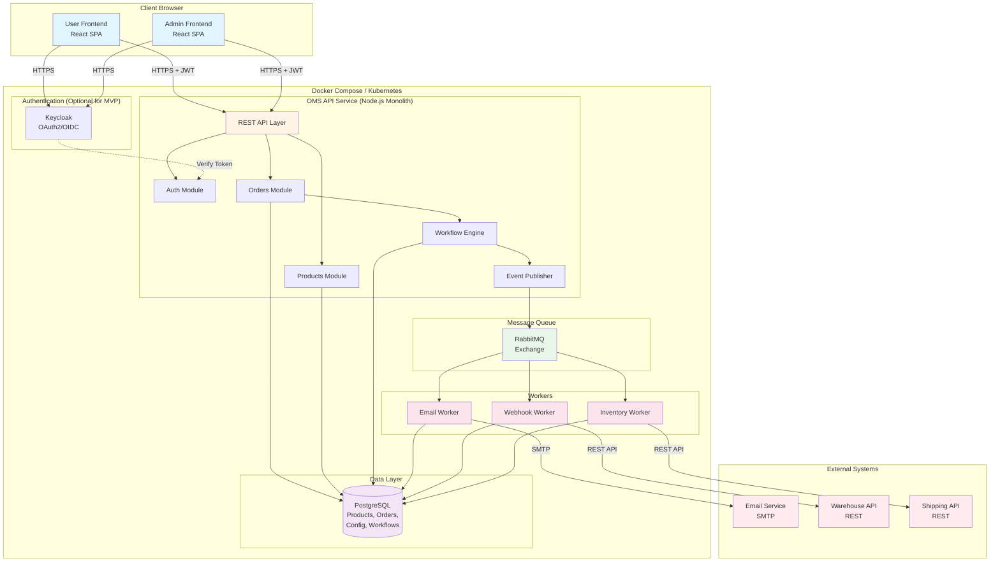

# Order Management System (OMS)

This document outlines the architecture decisions for building a
scalable, white-label Order Management System (OMS) designed for on-premise
deployment.

## How to run locally

1. Clone the repo

2. Run backend
2.1. Navigate to the backend directory `backend`
2.2. Install dependencies with `npm install`
2.3. Start the development server with `npm run start:dev`

The server will start on port 3000.

3. Run frontend
3.1. Navigate to the frontend directory `frontend`
3.2. Install dependencies with `npm install`
3.3. Start the development server with `npm run start`

The frontend will start on port 5173.

Detailes how to work with each codebase can be found in their respective README.md files.

## Design Goals

- **White-Label**: Configurable workflows, statuses, branding per customer
- **On-Premise Ready**: No cloud dependencies, Docker-based
- **Scalable**: 10k orders/day → horizontal scaling not required, but possible

## Core Architecture Decisions

### 1. **Modular Monolith** (instead of Microservices)
**Why:**
- Simpler deployment for on-prem customers
- Less operational complexity (easier to maintain)
- Sufficient for 10k orders/day (~7 orders/minute)
- Can be split into microservices later

**Modules and Components:**
- Auth Module (JWT Verification)
- Products Module (Product Management)
- Workflow Engine (Status Transitions)
- Orders Module (Order Creation/Updates)
- Event Publisher (RabbitMQ Integration)

### 2. **PostgreSQL** as central database
**Why:**
- JSONB for flexible Product Attributes (Furniture vs Electronics)
- ACID Transactions for Order Creation
- Proven, stable, on-prem friendly

**Key Tables:**
- `products` - with JSONB attributes for flexible product parameters
- `orders` - with JSONB shipping_address & status_history
- `order_status_transitions` - defines allowed workflow transitions
- `worker_configurations` - White-Label configuration for integrations

### 3. **RabbitMQ + Workers** for asynchronous processing
**Why:**
- Decoupled Architecture - API doesn't block on external calls
- Retry Logic & Dead Letter Queues for fault tolerance
- Horizontal Scaling of Workers independently
- On-prem alternative to AWS SQS

**Event Flow:**
```
API → RabbitMQ → Workers → External Systems (Email, Warehouse, Shipping)
```

**Worker Types:**
- Email Worker (Customer notifications)
- Webhook Worker (REST API calls to external systems)
- Inventory Worker (Inventory updates)

### 4. **White-Label via Database Configuration**
**No Multi-Tenancy** (each customer = separate deployment):

**Configurable:**
- Branding (Logo URL, Colors, Shop Name)
- Order Statuses (custom codes & names)
- Workflow Transitions (which status transitions are allowed)
- Worker Actions (which integrations at which status)
- Product Attributes (JSONB schema per category)

**Advantage:** UI can display/edit worker configurations

### 5. **Authentication Strategy**

**MVP:** Mock AuthService with JWT

**Production:** Keycloak (OAuth2/OIDC)

**Enterprise:** Keycloak Federation with Entra ID

**Why Keycloak:**
- Open Source, free
- Runs in container (on-prem ready)
- Entra ID Integration out-of-the-box
- No need to write custom auth logic

### Separate SPAs for admin and customer
**Why:**
- Admins need extended UI for Workflows, Products, Config
- Customers need simplified UI for Orders and Account Management
- Security reasons: Separation of access rights and data

## Deployment Strategy

Start with Docker Compose, migrate to Kubernetes
later if needed.

### Development
```bash
docker-compose up
# postgres, rabbitmq, backend, workers
```

### Production - Option 1: Docker Compose (Small Clients)
```yaml
# On customer server
backend
    ├─> postgres (persistent volume)
    └─> rabbitmq (persistent volume)
email-worker
webhook-worker
```

or if simple horizontal scaling of backend is needed:

```yaml
# On customer server
nginx (SSL termination)
  └─> backend (3 replicas, load balanced)
      ├─> postgres (persistent volume)
      └─> rabbitmq (persistent volume)
  └─> email-worker
  └─> webhook-worker
```

### Production - Option 2: Kubernetes (Large Clients)


## Security

1. **Authentication:** JWT Tokens (Keycloak)
2. **Authorization:** Role-based (admin, manager, customer)
3. **Input Validation:** Zod schemas for all API inputs
4. **SQL Injection:** TypeORM (parametrized queries)
6. **HTTPS:** TLS enforced everywhere
7. **Network Isolation:** Backend services not publicly exposed, only backend API or via load balancer
8. **Secrets:** Environment Variables (.env files)

## Scalability

### Horizontal Scaling
- **API:** Stateless, can have N replicas
- **Workers:** Each worker type can have N instances
- **Database:** Read Replicas for read load (optional)
- **RabbitMQ:** Multiple consumers support
- **Containerization:** Migration to Kubernetes or to Cloud possible if needed
- **Migration to Microservices:** Possible if needed

### Performance for 10k orders/day
- **Throughput:** ~7 orders/minute = very low
- **Single API instance:** Can handle 100+ req/sec → more than enough
- **Scaling only needed:** At 100k+ orders/day

##  Error Handling & Monitoring

### Error Handling
1. **API:** Standardized error responses (400, 401, 403, 404, 500)
2. **Database:** Transactions with rollback on failure
3. **Workers:** Retry logic (exponential backoff, max 3 retries)
4. **Dead Letter Queue:** Failed messages after 3 retries
5. **Graceful Shutdown:** Finish active requests before exit

### Monitoring
- **Health Checks:** `/health` endpoint (DB, RabbitMQ status)
- **Structured Logging:** Winston/Pino with JSON format
- **Error Monitoring:** Sentry integration (backend + workers)
- **Metrics:** Collect server metrics (CPU, Memory, Request Latency)

### Testing
```
Unit Tests        → Business Logic, Services (Jest)
Integration Tests → API endpoints (Jest + Supertest)
E2E Tests         → Complete order workflows (Playwright)
```

## Technology Stack

| Component | Technology | Why |
|-----------|-----------|-------|
| API | Node.js + TypeScript | Modern, async, good libraries |
| Framework | Nest.js (Express/Fastify) | Proven, flexible |
| ORM | TypeORM | Type-safe, Migrations |
| Validation | Zod | Type-safe schemas |
| Database | PostgreSQL | JSONB, reliable, on-prem |
| Message Queue | RabbitMQ | On-prem alternative to SQS |
| Auth (prod) | Keycloak | Open source, Entra ID ready |
| Container | Docker + Compose | Standard, easy for customers |
| CI/CD | GitHub Actions | Free, integrated |
| Testing | Jest + Supertest | Standard Node.js stack |


##  Key Workflow: Order Creation

```
POST /orders
1. JWT Auth (verify token)
2. Input Validation (Zod schema)
3. Database Transaction
4. Publish Event to RabbitMQ
5. Return Response:
   201 {orderId, status, total}

[Async]
Workers consume event → check configurations → execute actions
```

## Key Workflow: Status Change

```
PATCH /orders/:id/status {newStatus}
1. Load current order status
2. Check order_status_transitions:
   - Is transition allowed?
3. If allowed:
   - UPDATE order status
   - ADD to status_history
   - PUBLISH order.status_changed event
4. Return 200 OK

[Async]
Workers filter by trigger_statuses → execute configured actions
```

## Architecture Diagrams

